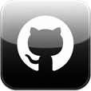

# GitHub Legacy


[](https://github.com/kitalev/GitHub-Legacy/releases/latest)
[](LICENSE.ru.md)

[English](README.md) · **Русский**

---

Лёгкий нативный клиент GitHub для iOS 6–10: репозитории, README, issues, pull request'ы, коммиты и релизы — без Safari и без официального приложения, которое на этих версиях уже не запустить.

## Возможности

- Просмотр репозиториев, популярных проектов и поиск по названию, теме или пользователю
- Отрисованные README, issues, pull request'ы и полная история коммитов
- Скачивание файлов релизов прямо на устройство (`.deb`, `.ipa`, исходники и т.д.)
- Избранные репозитории и подписки на пользователей, отдельная вкладка с новостями релизов из избранного
- Светлая и тёмная темы, переключение языка приложения прямо в настройках

## Установка

### Из последнего релиза (.deb)

1. Скачайте `.deb` со страницы [последнего релиза](https://github.com/kitalev/GitHub-Legacy/releases/latest).
2. Поместите файл `.deb` на устройство (например, в `/var/mobile/`).
3. В iFile найдите `.deb`, нажмите на него и выберите `Install`.

Либо через терминал:

```bash
dpkg -i com.githublegacy.app_iphoneos-arm.deb
```

### Из последнего релиза (.ipa)

Скачайте `.ipa` со страницы [последнего релиза](https://github.com/kitalev/GitHub-Legacy/releases/latest) и установите любым инструментом сайдлоада (AltStore, Sideloadly и т.д.). Джейлбрейк не требуется.

## Сборка

Нужен **Theos**, с переменной `THEOS`, указывающей на его путь:

```bash
export THEOS=/opt/theos
```

Также понадобится Clang-toolchain с таргетингом на iOS (например, `$THEOS/toolchain/linux/iphone/bin`) и iOS SDK ≥ 6.0 в `$THEOS/sdks/`. Готовые официальные SDK 6.1 давно не распространяются отдельно от Xcode; подойдёт и более новый SDK, так как `MinimumOSVersion` в `Info.plist` уже ограничивает приложение устройствами с iOS 6+ во время выполнения.

```bash
# .deb (несандбоксная сборка, для джейлбрейк-устройств через Cydia/Sileo)
make clean
make package FINALPACKAGE=1

# .ipa (обычное сандбоксное приложение, для сайдлоада)
make clean
make package FINALPACKAGE=1 PACKAGE_FORMAT=ipa
```

Готовые пакеты появятся в `packages/`.

## Удаление

### Через Cydia/Sileo

Удаляется как обычный пакет.

### Через терминал

```bash
dpkg -r com.githublegacy.app
```

## Лицензия

[MIT](LICENSE.ru.md) (неофициальный перевод; оригинал — [LICENSE](LICENSE))
